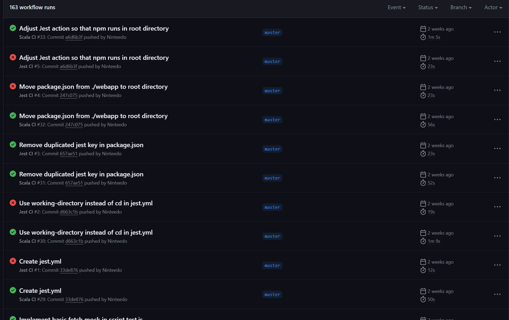
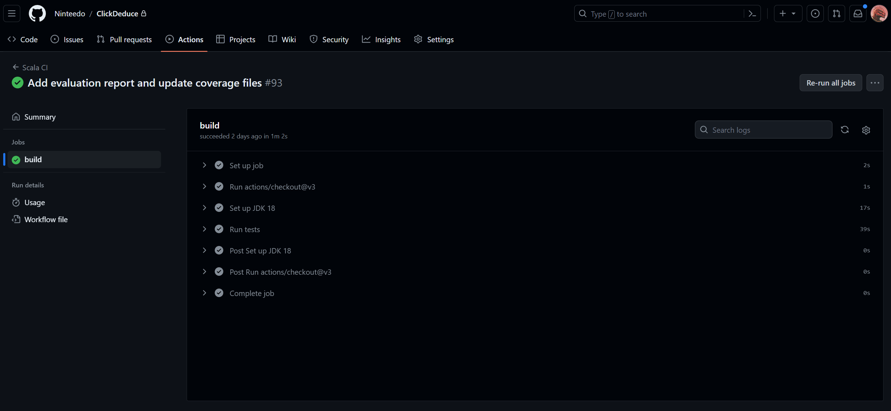
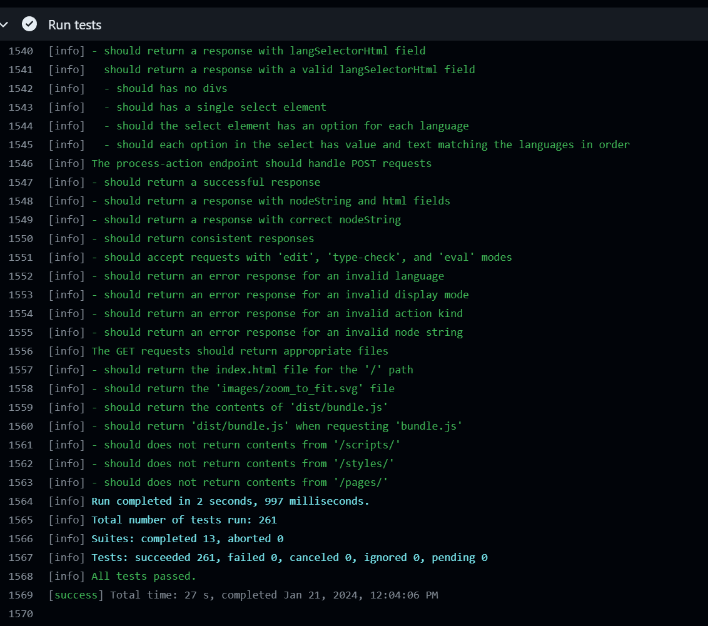
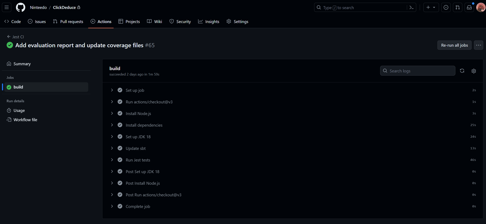
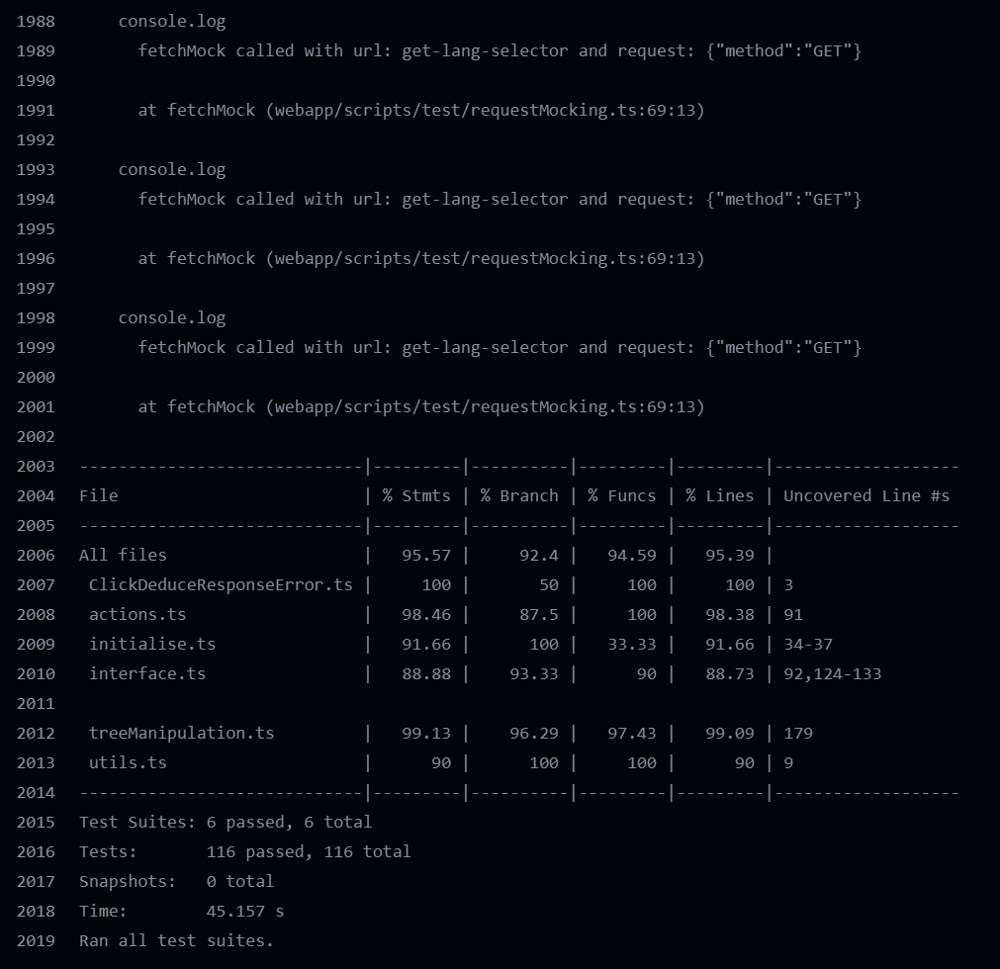
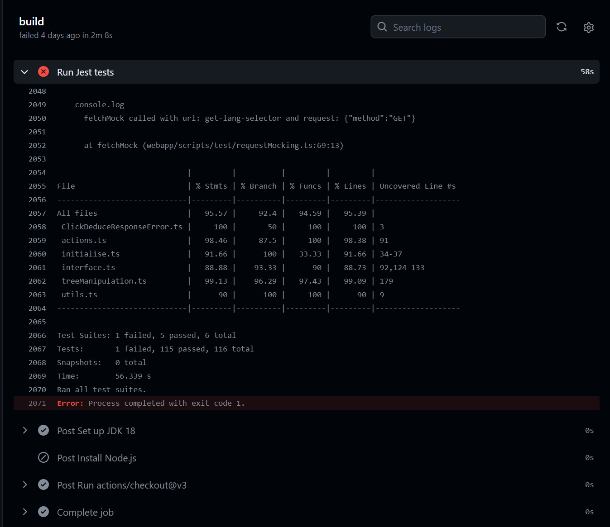

# Continuous Integration

The project repository is hosted on GitHub which provides a number of features for continuous integration.

I decided to use GitHub Actions for the CI pipeline, as it is built into GitHub so didn't require any services to use.
I did not want to spend lots of time learning how to use an external CI service.
Furthermore, as a student, GitHub provides me with a certain amount of free server time.

Having the CI process in the same place as the repository also makes it easier to manage and keep track of test results.
Each commit has a link to the CI workflow and a checkmark if it passed.

It also means that I can tell that the application works in a clean environment, as the tests are run on a
fresh virtual machine and everything is installed from scratch.
This means I won't run into issues where the tests pass on my machine but not on another.

The GitHub Actions workflows are defined in [.github/workflows](../.github/workflows).

## Limitations of GitHub Actions

The main limitation I found was that the result of testing was simply a pass or fail, rather than a breakdown of
which tests passed and which failed.
While it is possible to view the logs of the tests, this is not as convenient as having a summary of the results.
This is in comparison to the IDE I was using (IntelliJ IDEA), which provides a tree-view of the tests and their results.

Another limitation is that the workflows are not run on every commit, but rather on each push.
This means that if multiple commits are pushed at once, the CI workflow will only run once, making it harder to identify
which commit caused the tests to fail.

A limitation that would likely be present in any CI service is that server time is limited and can cost money.
Even with the free server time provided by GitHub, I was still conscious of how much time the workflows were taking.

## Scala CI

The Scala CI workflow is defined in [scala.yml](../.github/workflows/scala.yml).

The workflow is designed as follows:

1. Start a virtual machine running Ubuntu
2. Checkout the repository
3. Install the JDK (Java) and SBT (Scala)
4. Run the tests using SBT and ScalaTest. This step also installs the dependencies defined in [build.sbt](../build.sbt)
5. End of workflow. It passes as long as it was able to install everything and then all the tests passed

Note that the web server part of the application is not tested here, as it used in the Jest tests.

## Jest CI

The Jest CI workflow is defined in [jest.yml](../.github/workflows/jest.yml).

The workflow is designed as follows:

1. Start a virtual machine running Ubuntu
2. Checkout the repository
3. Install Node.js and NPM
4. Install the JDK (Java) and SBT (Scala)
5. Install the dependencies defined in [build.sbt](../build.sbt). This is executed separately from the tests since it
   could potentially cause a timeout if it takes too long
6. Run the tests using Jest. This step also installs the Node.js dependencies defined in [package.json](../package.json)
7. End of workflow. It passes as long as it was able to install everything and then all the tests passed

Java and SBT are installed because for the server integration tests the Scala web server is started and then responds
to requests from the Jest tests.

Previously, there was a separate workflow for the server/webpage integration tests, but this was merged into the Jest
workflow to reduce the number of workflows.
It followed the same steps of the current Jest workflow, but only ran the server integration tests.
I removed it since it seemed redundant to have two workflows that did almost the same thing.
It could have potentially made it clearer which tests failed, but I decided that running additional workflows
(that could potentially rack up minutes of usage) was not worth it. 
The vast majority of each test's duration is spent installing dependencies, so extra workflows would take up a lot of
server time.

## Improvements

The main improvement I would make is to add a step to automatically generate reports for which tests passed and failed,
as well as a coverage report.
This would make it easier to see which tests failed, and analyse the coverage of the repository over time.

I was worried this would clog up the repository with lots of additional commits, and I didn't investigate it further
due to time constraints.
