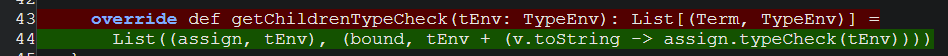
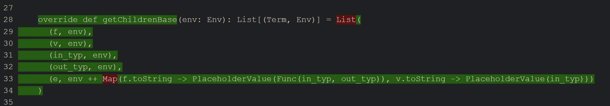
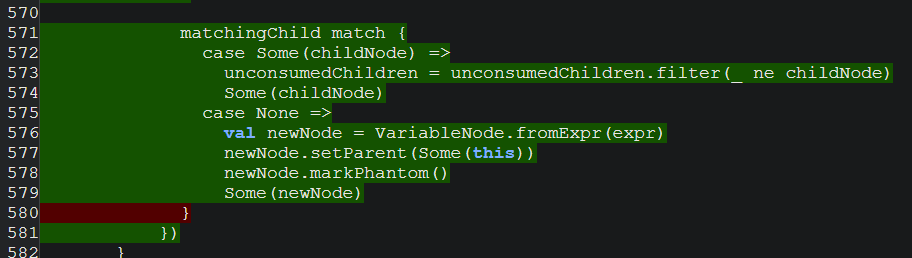
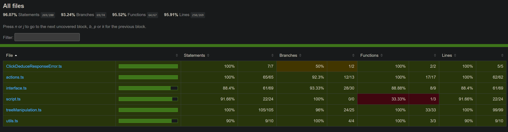
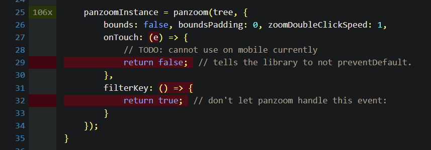
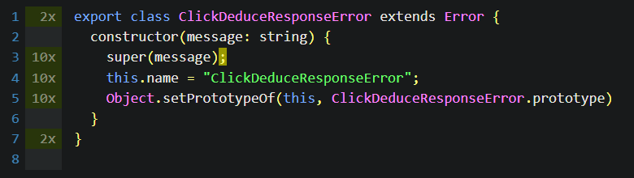

# Coverage

The automatically generated coverage reports appear in the `/coverage` directory, but this is not 
included in the repository.

There is a copy of the final coverage reports before submission in the [`softtest/coverage`](./coverage) directory,
which this document will refer to.

## Scala

### Coverage Tools

The Scala coverage report is generated using the IntelliJ IDEA coverage tool and can be viewed 
[here](./coverage/scala/index.html).

I had issues with multiple different coverage tools I tried, so I ended up using IntelliJ's built-in tool.
It was not perfect, but seemed to have less obvious issues than JaCoCo and Scoverage.

I believe the issues with these tools are due to the fact that they are primarily designed for Java, and
Scala's functional nature makes it difficult to determine which lines are actually executed.

This project also makes extensive use of Scala's reflection capabilities, which could also be a factor.
Reflection allows the program to access information about itself at runtime, which is useful for
dynamically creating instances of classes, but it is not unreasonable to assume that this could cause issues
for coverage tools.

There are instances where a line is marked as not covered, but a proceeding line is covered, which is
impossible in Scala.

Understanding this, I believe that many of the coverage values are pessimistic, and that the actual coverage
is higher than reported.

I believe that the repository is well tested, and visually inspecting the coverage report shows that 
a lot of the uncovered lines should be covered in reality.

#### Branch Coverage

I also found that the branch coverage was inaccurate, as even a simple `if` statement was marked as hundreds of
branches, resulting in branch coverage under `30%` for the repository, which was not a useful measurement.

It is possible that the branch coverage is accurate, but I believe that it is more likely that there is some inaccuracy.

With more time, I would have liked to investigate this further, as branch coverage is a very useful metric.

### App Package

The reported coverage for the `app` package is `85%` for methods and `75%` for classes.

The most important uncovered methods are `WebServer.main`, `WebServer.bundleScripts`, and `WebServer.runServer`.

It was not possible to test `WebServer.main` because it caused errors in the GitHub Actions workflow.
The unused test file is [ServerHostTest](../src/test/scala/app/ServerHostTest.scala.disabled).

#### Coverage During Jest Tests

However, while these methods are not covered during the Scala tests, they are executed during the 
Jest server integration tests. 

If this is considered sufficient, then the coverage is `100%` for methods, though
some lines for error handling are not covered. 

All but 4 lines are executed on the normal execution path, meaning that the line coverage is 
`169/173 (97%)`.

### Languages Package

The reported coverage for the `languages` package is `89%` for methods and `90%` for lines.

Each of the specific language classes (`LArith`, `LIf`, `LLet`, `LLam`, and `LRec`) have 
`100%` coverage for methods and lines. `LLet` is marked as having an uncovered line, but it clearly is covered 
(see [coverage tools](#coverage-tools) section).

The language trait classes (`AbstractLanguage`, `AbstractNodeLanguage`, and `AbstractActionLanguage`) have worse
coverage. I attribute this to two main factors:
1. These classes have a lot of error cases, the handling of some of which overlap, making others unreachable.
   For example, the `getParent` method of `InnerNode` has multiple error cases, but the `setParent` method
   will throw an error in the same cases, so the `getParent` error cases are unreachable.
2. There are some unused methods which have been left in the code for future use, for example the `indexOf` method
   of `OuterNode`.
3. There are some cases where a trait or abstract class has a method implementation which is overridden in every
   subclass, so it is unreachable. These could be removed, but are also left in for ease of future development.

#### Abstract Action Language

The reported coverage for the `languages/ActionLanguage` package is `80%` for methods and `87%` for lines.

## TypeScript

The TypeScript coverage report is generating using Jest with the `--coverage` flag and can be viewed
[here](./coverage/jest/lcov-report/index.html).

The reported coverage is `96%` for statements, `93%` for branches, `95%` for functions, and `95%` for lines 
(rounding down).

### Coverage Tools

I found that the coverage report generated by Jest was mostly accurate, and it was easy to begin using it.
I did not attempt to use any other coverage tools, as I was satisfied with the results from Jest.

There are, however, some oddities, which I will discuss below.

### Uncovered Code

#### PanZoom

The primary cause of concern in my coverage is the usage of the `PanZoom` library, which is used to allow
the user to pan around and zoom in and out of the graph.

I was not able to find a way to automatically test the functionality of this library.
I did however manually test it, and it works as expected.
I do not believe that it is necessary to write an automated test for this, as it is a third-party library and its
functionality is difficult to capture in a test.

`PanZoom` would error when running the tests in the `JSDOM` environment, so I replaced it with a mock implementation.

The low function coverage in [`initialise.ts`](../webapp/scripts/initialise.ts) is due to some of the arguments for
initialising the `PanZoom` library being functions.
These functions are both trivial and difficult to test due to the aforementioned reasons,
so I do not believe this is problematic.

For similar reasons, I did not write automatic tests for the `zoomToFit` function in
[`interface.ts`](../webapp/scripts/interface.ts), which is used to zoom the graph to fit the window.
This is the primary reason for the lower coverage in this file.

#### ClickDeduceResponseError

This is a very short file which is just a class definition for a custom error.

There is no branching in this file, so the `1/2 (50%)` branch coverage is inaccurate.
The coverage seems to be reporting the semicolon at the end of a line as an unvisited branch,
which is presumably a bug in the coverage tool.

#### `[utils.ts](../webapp/scripts/utils.ts)`

There is one line in this file which is not covered, which is an error case for the `getSelectedMode` function.

There is no way that this line can be reached without the user manually editing the DOM,
and the line only exists to throw an error in this case, so I do not believe that this being uncovered is problematic.

## Conclusion

I believe that the repository is well tested, and that the coverage reports are accurate enough to be useful.

There were issues with the Scala coverage tools, so I believe that the coverage is higher than reported.

The TypeScript coverage is reported as very high, but I believe the uncovered code is not problematic.
